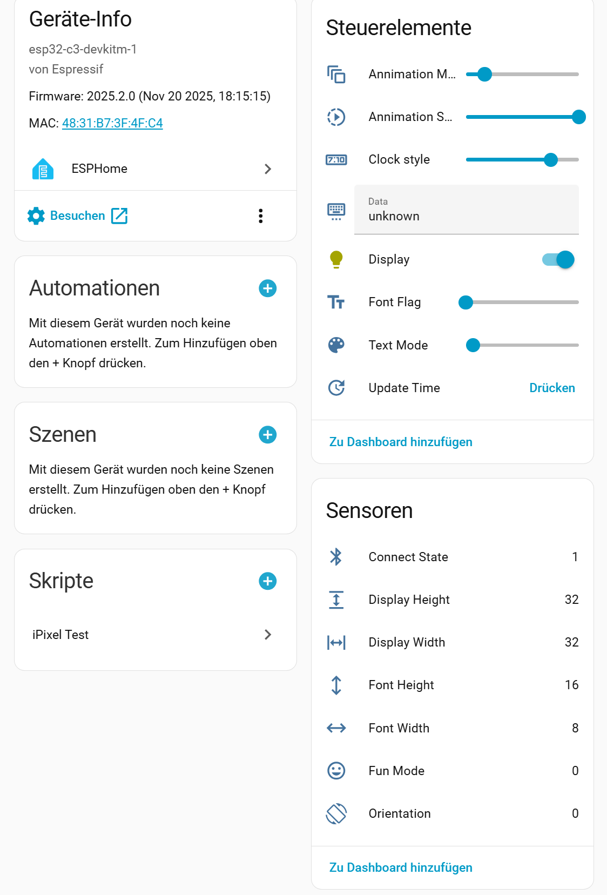
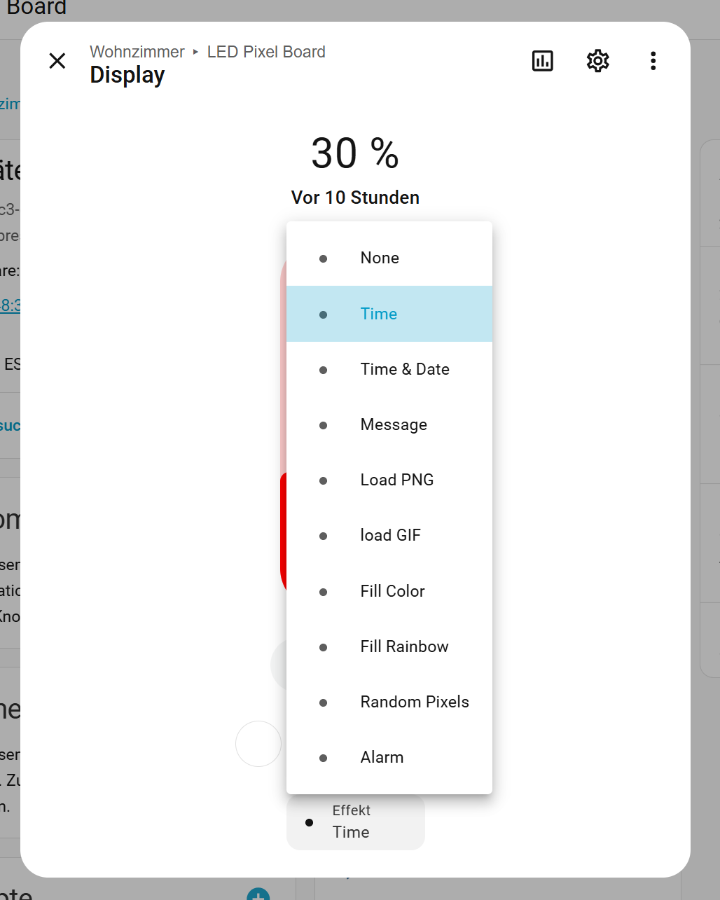

## EESPHome integration for a LED Pixel Board

### How to integrate into HomeAssistant

When this external component is compiled and uploaded to the esp32 module you hopefully get a message on your Hoeassistant instance about a new ESPHome device detectet. Allow to import it. The device page will show up as follows.



### The internal components explained

- **Animation Mode** (number 0-9, default: 1)   
  exlusive for the Message effect. Animation Speed does apply.
  
  0: text is displayed in pages   
  1: text scrolling from right to left   
  2: text scrolling from left to right   
  3: text scrolling from bottom to top   
  4: text scrolling from top to bottom  
  5: text flashing   
  6: text with brightnes rising  

- **Animation Speed** (number 1-100, step: 5, default: 100)   
  exlusive for the Message effect

- **Clock Style** (number 1-9, default: 7)   
  exlusive for the Time and Time & Date effect
  Same styles as selectable in the iPixel Color App 

- **Data** (text input)   
  text input for the Message effect

- **Display** (rgb light)   
  First of all you can switch on and off the display;)
  Cliking on the text "Display" will open the rgb light dialog (see next chapter)

  Effects:
  - **None** calls the clear() method which shows the inintial image of the device  
  - **Time** displays an internal clock frame  
  - **Time & Date** display alternating clock and date  
  - **Message** display text  
  - **Load PNG** displays an internal stored 32x32 image  
  - **Load GIF** no function (work in progress)  
  - **Fill Color** fills the entire display with the current color  
  - **Fill Rainbow** loads an image with diagonal rainbow colors  
  - **Random Pixel** calls the setPixel() method with random coordinates and colors every 300ms  
  - **Alarm** changes brightness in a falling ramp every 300ms  

- **Font Flag** (number 1-4, default: 0)  
  exlusive for the Message effect
  
  0:  8x16 Font  
  0:  8x16 Font   
  1: 16x16 Font   
  2: 16x32 Font   
  3:  8x16 Font (encoded with width and height parameters per char, not compatible with my display)   
  4: 16x32 Font (encoded with width and height parameters per char, not compatible with my display)   

- **Text Mode** (number 0-4, default: 0)
  exlusive for the Message effect
  
  0: text color taken from the rgb light color   
  1: Text color white   
  2: top to bottom rainbow effect (yellow to red)   
  3: top to bottom rainbow effect (light blue to white)   
  4: top to bottom rainbow effect (blue to yellow)   
  
- **Update Time**
  Usually the internal clock of the display gets synchronized every hour by this device based on the homaassistant time (requires ipixel-ble.yaml time entry at the end of the file). If, for what reasons ever, the time is not up to date press this button. If it is still not correct soemting is wrong with your Homeassistant time. 
 
### The display rgb light component explained

Cklick on the text "Display" of the RGB light component to open detailed settings. Here you can set brightness, color and effects.




### HomeAssistant scripting

Example for setting the LED pixel bord to default:
```
script:
  sequence:
  - action: light.turn_on
    metadata: {}
    data:
      brightness_pct: 20
      effect: Time
    target:
      entity_id: light.ipixel_ble_display
  alias: iPixel Default
  description: 'set the LED pixel board defaults'
```
Example for displaying a text message:
```
script:
  sequence:
  - action: light.turn_on
    target:
      entity_id: light.ipixel_ble_display
    data:
      rgb_color:
      - 255
      - 255
      - 0
    effect: "Load PNG"
  - device_id: ipixel_id
    domain: number
    entity_id: font_mode_id
    type: set_value
    value: 2
  - action: text.set_value
    metadata: {}
    data:
      value: This is a script message from Homeassistant
    target:
      entity_id: text.ipixel_ble_data
  - action: light.turn_on
    target:
      entity_id: light.ipixel_ble_display
    data:
      effect: Message
      brightness_pct: 100
  alias: iPixel send and display text
  description: 'display text on the LED pixel board'
```


